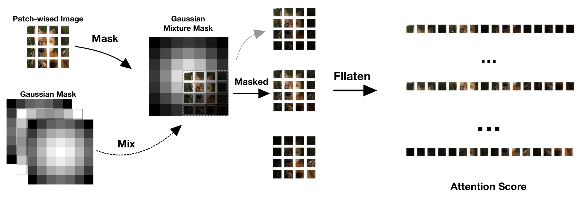

# Gaussian-Mixture-Mask Attention

## Abstract

The success of Transformers in the field of images has led to the development of many excellent vision transformer variants, but these variants often lack scalability and cannot be used together in many cases. We propose an attention mechanism based on Gaussian Mixture Mask (GMM), which can be applied to any visual transformer, plug and play. On small datasets, compared to the standard vision transformer, the performance is significantly improved without adding almost any parameters. We also compare with other excellent variants such as hierarchical Swin and deep CaiT. Under the same number of parameters, it is also better than these variants. Moreover, when it is inserted into other variants, it can continue to improve the performance of other variants.

## Approach



Our Gaussian Mixture Mask Attention Mechanism firstly defines multiple Gaussian Masks with different parameters $\sigma$ and $\alpha$ for an image in patch-wise, and then linearly combines these Gaussian Masks to form a Gaussian Mixture Mask of size $2n-1$. Afterwards, a 'reverse-convolution' operation is performed in the Gaussian Mixture Mask, and the masked image is unfolded row-wise to obtain attention scores, which are regulated by the distance.


By observing the experimental results, we found that this simple learnable mask has the following regularities: patches inhibit the flow of information to themselves, and the correlation coefficient between patches varies with distance. Based on these geometric features, we propose a Gaussian Mixture Mask to fit the distribution and show how it fits the simple and learnable mask.

## Outcomes

| Model          | CIFAR-10  | CIFAR-100 | SVHN    | Tiny-ImageNet |
| -------------- | --------- | --------- | ------- | ------------ |
| ViT-base       | 94.17\%   | 75.36\%   | 97.93\% | 59.89\%      |
| GMM-ViT        | 94.75\%   | 77.81\%   | 98.01\% | 61.86\%      |

## Run scripts

### Original model

```bash
python main.py --model [model_name]
```

### GMM variants

```bash
python main.py --model [model_name] --is_GMM
```

## Acknowledgements

We would like to express our great appreciation to the authors of the SPT_LSA_ViT and pytorch-image-models repositories, aanna0701 and rwightman, for their great help to the machine learning community. Their provided models and related technical supports have helped us to explore this field in a more comprehensive and in-depth way, thus enhancing our learning efficiency.

